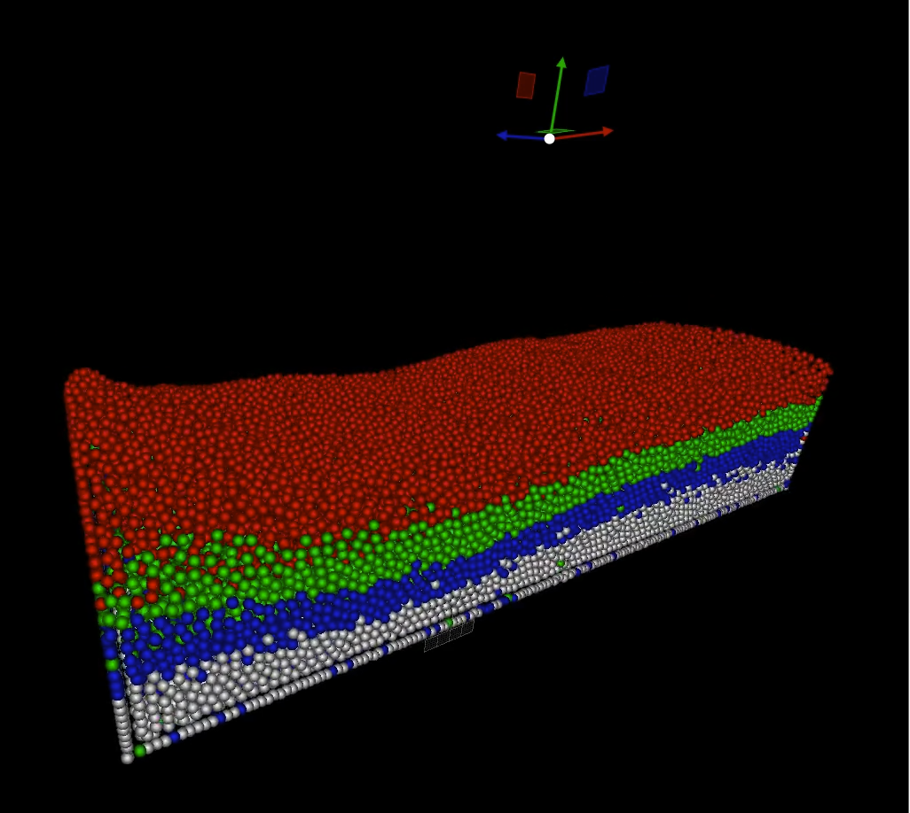
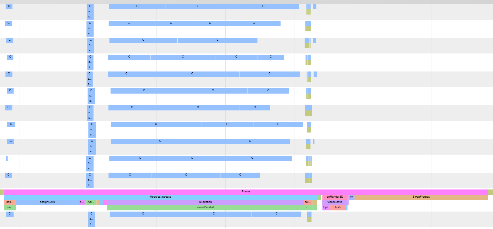

# Introduction

This document describes the approach I have taken to perform a particle simulation in 3D using only the CPU's. The process allows to update 32K particles with collisions using 12 CPU's in just 4ms per update. Today it's more common to perform these type of simulations using the GPU, but I wanted to explore first the use of the CPU's.

[](results/sim00.mp4)

The sample code focus on the simulation and uses a small framework with DirectX 11 to draw a small sprite on each particle position. 

The simulation is based on the repository from https://github.com/kotsoft/particle_based_viscoelastic_fluid, uses ImGui (https://github.com/ocornut/imgui), and the thread pool from https://github.com/progschj/ThreadPool (both included)

## Build and run in Windows

Open viscoelastic.sln with Visual C++ 2022 and press F5 in Release

## Particles

The simulation requires to store for each particle:
- position (3 floats)
- velocity (3 floats)
- prev_position (3 floats)
- cell_id, index_in_cell (2 ints)
- type (1 byte)

We will store each information in a separate linear buffer, using a SoA (Structure of Arrays) instead of AoS (Array of Structures). When we move to use sse/avx/avx2, even the 3 coords xyz of the vectors will be stored in separated linear buffers.

## Spatial Index

The objective is to be able to quickly find for each particle, all the particles nearby in a radius R.

For this we are going to split the 3D space in a regular grid of cells of fixed size. Each cell has 26 neighbours in 3D space.
We will identify each cell uniquely by its own 3D integer coordinates:

```cpp
    Int3 cell_coords = floor( pos * scale_factor );
```

Because we don't know the 3D limits of our simulation, we will store the information for a limited number of cells, say 64K cells for example. 
We are going to generate a hash number for each cell_coords and use it to assign each coords to a planar array, using the lower bits of the hash.

```cpp
    uint32_t cell_id = hash( cell_coords );
```

Something like:

```cpp
    uint32_t hash( Int3 coords ) const {
      return ( (coords.x * prime1) ^ (coords.y * prime12) ^ (coords.z * prime3) ) & num_cells_mask;
    }
```

And in our case num_cells_mask = 64K - 1, so 0xffff

For each cell, we are going to store the following information: (u32 = unsigned int of 32 bits, and Int3 stores x3 ints)
```cpp
    struct CellInfo {
      u32  tag = 0;
      u32  count;		// Keep track of the number of particles associated to this cell in this frame
      Int3 coords;		// Current coords associated to this cell
      u32  base = 0;
    };
```
The tag is going to be an integer we will increase on each iteration of the simulation and allows us to recognize if the cell has been used in this frame or not.

We will need to deal with some hash collisions, when two cells with different cell_coords are assigned to the same cell_id number. In that case we will use a linear probing and use the next cell_id that it's available.

The algorithm is then:
1. Define a u32 current_tag, and increment it on each frame
2. For each particle.position, find the official cell_id:  onst CellInfo& cell = cell_infos[ cell_id ]
3. Check the CellInfo associated to the cell_id (array access):
  - If this is the first time we use this cell (comparing the tag vs current_tag):
    - We update the tag of the cell and reset the cell.count = 0 
    - We store in a separate array the cell_id as 'being used in this frame'
  - Otherwise, we need to confirm if the coords of the cell match the coords of our particle. If we need to find another cell, just increment the cell_id by one and try again. (Linear probing)
4. If the coords also match, the cell_id is good, increment the count of the cell_info struct.

In either case, save to cell_id and the current count in the cell that has been assigned to the particle.

This is not thread safe.

Once all the particles have been assigned a cell_id and the index in each particle, we also end with the list of cells (a selection of our big list of 64K cells) which 
contains particles. In my tests, we might use around 4000 particles of the 64K (6% approx).

We are free to 'sort' the cell_id's to our best interest. 

Then, we run the following code:

```cpp
    u32 acc = 0;
    for( u32 cell_id : used_cell_ids ) {
      cells[ cell_id ].base = acc;
      acc += cells[ cell_id ].count;
    }
```

Now we can run a final stage, where each particle is moved to a unique position	in a linear array.
```cpp
    for( u32 particle_id : num_particles ) {
      Particle p = old_particles[ particle_id ];
      u32 final_index = cells[ p.cell_id ].base + p.count_in_cell;
      new_particles[ final_particle_index ] = p;
    }
```
This stage can be run in parallel, as each particle already has a unique index associated.

At this point, we have a list of cells containing particles. Each cell has a base and count where we can access all the particles associated to the cell in a linear buffer.
For 32K particles, this takes about 1.4ms

## Simulation

- Apply external forces (gravity for example)
- Estimate new position
- Apply viscosity
- Apply results of viscosity
- Resolve collisions with walls
- Compute new_velocities

The huge cost goes to the apply viscosity, where for each particle we need to find the influence of all nearby particles.
For the viscositySolve to work, we make a copy of the positions of each particle, and accumulate the expected changes of each particle in a separate buffer, this way the we could run each particle in parallel without locking mechanisms

## Collisions

The collisions will be handled using a collection of SDFs (Signed Distance Functions). In the current implementation we check each particle against an array of oriented planes, spheres and oriented boxes. The check affects only the position of the each individual particle which means we can run it in parallel using multiple threads.

With 6 planes we can define the interior of a box, and changing the orientation or the translation of the planes/spheres allows us to interact with the particles.

Right now, we check 32K particles vs 6 planes, and it takes xxx ms when running in parallel with 12 threads. Because most of the particles are not interacting with the walls, a posible optimization could consists of precomputing the list of sdf's that affect each cell, and check only the particles in those cells, as the spatial index already provides us with that information.

## Multithreading

Important considerations before going multithread:
- Avoid any locking or synchronization primitives at all cost, when possible.
  Even a single std::atomic<int> updated by all the threads generates a huge performance hit.
- We need to given a substancial amount of work to each thread to make sense. 
- When submitting a list of tasks to a pool of threads that were dormant, not all the threads start working immediately, and not 
  all the jobs require the same amount of time.
- Currently, some stages need to run from a single thread, like updating the spatial index.
- A simpler profiler is enough to confirm the usage of the CPU's

For example, If we need to update 32K particles with 12 threads, it's not a good idea to use a synchronization primitive like a std::atomic<int> for each particle to be updated. 
It's much better to split the 32K in jobs of for example, 1K particles, and let the threads pick one of the jobs and update those 1K continuous particles in a single shot.

There are two types of updates:

- Update all the particles where the update does not require neighbour information, like updating the position of each particle from the forces, update new velocity, etc. 
- Update all the particles based on the neighbours. Here we better update the particles by cell. So, get one cell, and process all the particles in each cell. Because the neighbours of the each particle in a cell are shared between all the particles, meaning the second particle will find the information in the local cache of the CPU.
	
Ideally, instead of giving just one thread, we better give a range of cells of each thread, if the range of cells are also close, we have even more chances to find the data already in the cache.
 
Remember that the spatial index we are using allows us to sort the cells by any criteria we want, and the particles in each cell are stored in continuous buffer.

## Results

For 32K particles, using 12 CPUs in a Ryzen Threadripper 3960X with 24-Cores, times in msecs

```
1.296 Spatial Hash
0.034 Velocities update
0.066 Predict Positions
3.042 Relaxation
0.229 Collisions
0.076 Velocities from positions
0.828 Render
4.908 Total update
```

And the thread utilizations during a single frame.



You can check the details openning the file `results/capture.json` using the `chrome://tracing/` url from Chrome. Or capture new traces using the `Profile Capture` button from the imgui

## Conclusions

- More threads does not mean better performance
- Multithreading pays off when enough independent work is pushed
- Allow to change the number of threads dynamically and bucket sizes within the app

## Improvements

- I have been testing an approach to generate the spatial index using multiple threads, but only pays off when more particles are being simulated
- The simulation is not fully viscoelastic as described in the original paper (https://dl.acm.org/doi/10.1145/1073368.1073400)

## Multithread generation of the Spatial Index

Generating the list of unique cell_id's and associate each particle with a unique position in a linear buffer, so that subsequent queries run in parallel is the purpose of this section. The proposed solution is the following:

- Each thread iterates over a range of particles.
- For each particle, compute the cell_id as normal
- Compute the group_id = cell_id & 7
- Each thread creates 8 groups, and stores each particle_id associated to each group
		groups[ group_id ].push_back( particle_id )
- At this points, each thread has organized the particles in 8 buckets
- Using a std::atomic<int> each thread allocates the number of particles for each group


