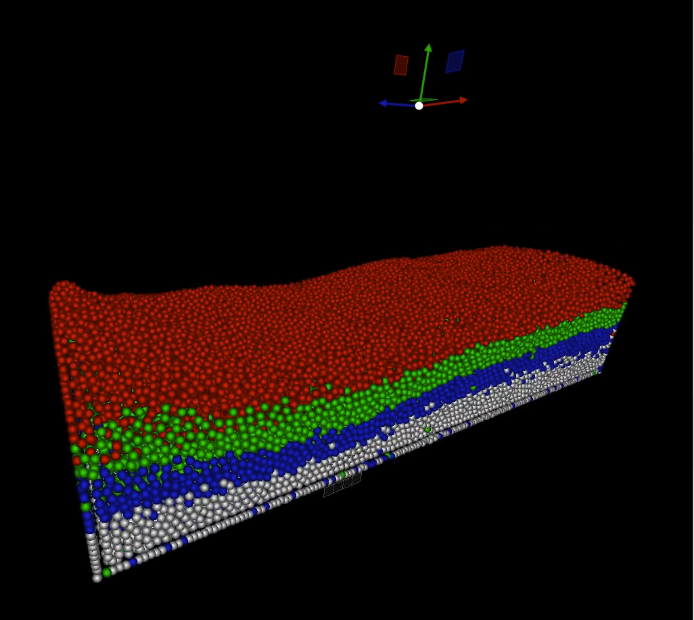
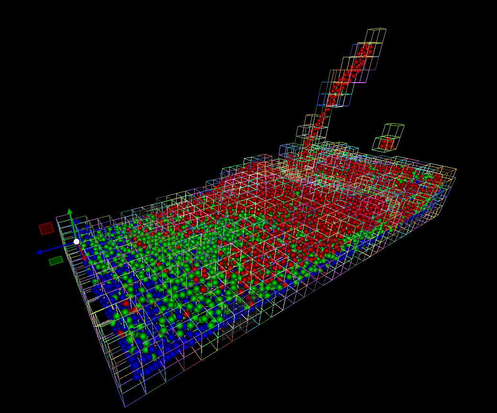
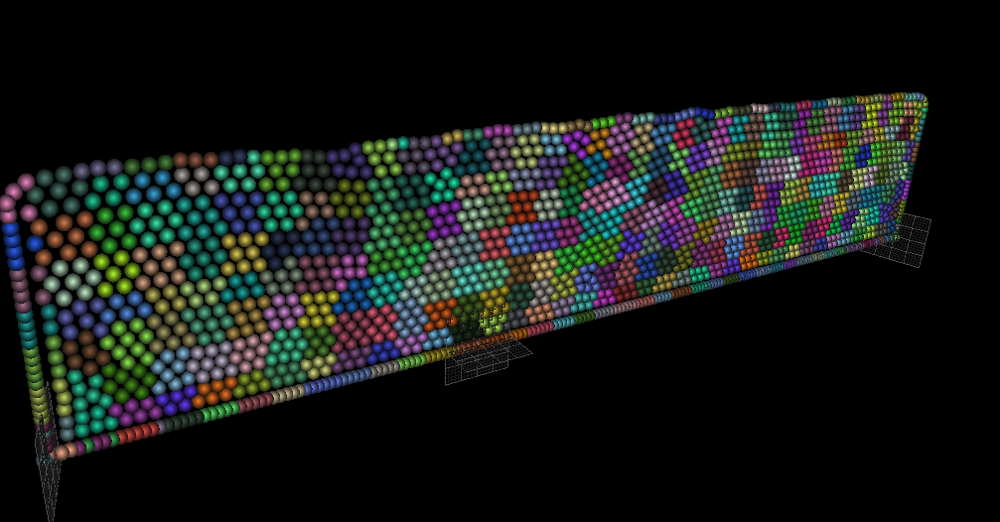
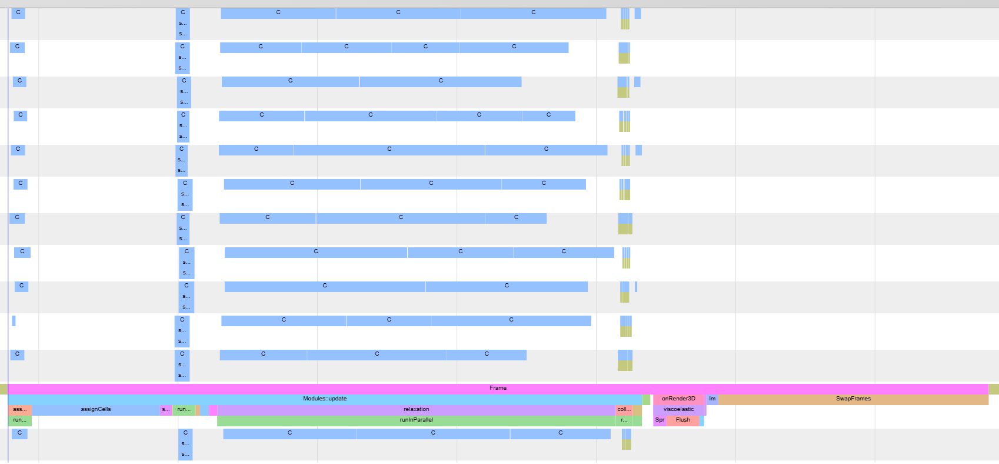
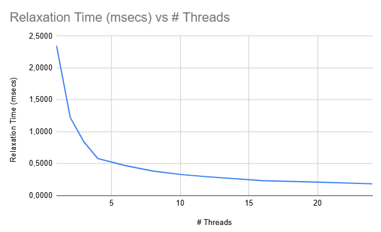
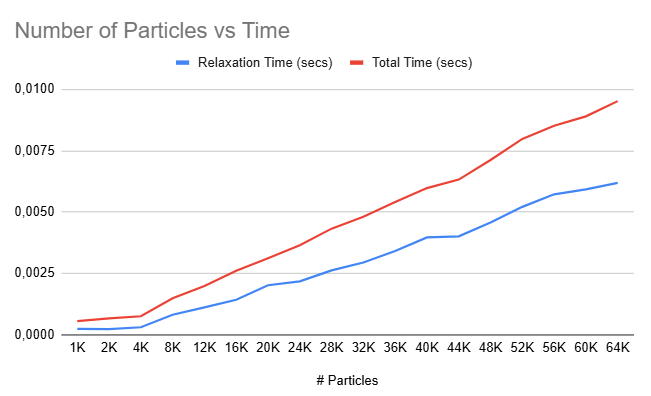
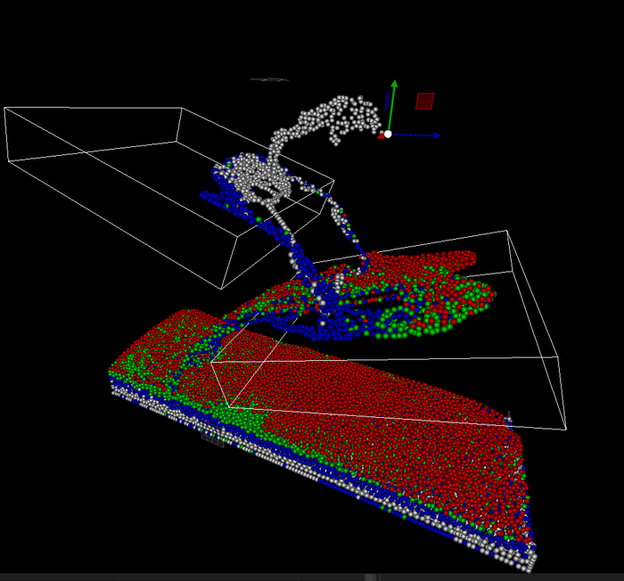
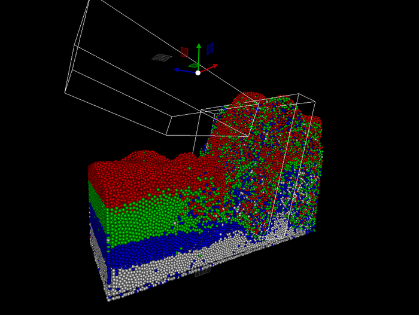

# Introduction

This document describes the approach I have taken to perform a particle simulation in 3D using only the CPU's. The process allows to update 32K particles with collisions using 12 CPU's in less than 3ms per update. Today it's more common to perform these type of simulations using the GPU, but I wanted to explore first the use of the CPU's.

[](https://www.youtube.com/watch?v=duHcCjZ-u30)
The sample code focus on the simulation and uses a small C++ framework with DirectX 11 to draw a small sprite on each particle position. 

The simulation is based on the repository from https://github.com/kotsoft/particle_based_viscoelastic_fluid, and uses code from the following repo (all included):
- ImGui (https://github.com/ocornut/imgui),
- ImGuizmo (https://github.com/CedricGuillemet/ImGuizmo)

## Build

### Windows

Open viscoelastic.sln with Visual C++ 2022 and press F5 in Release

### OSX

From a shell in the root of the repository, type:

    $ make RELEASE=1 -j
    $ ./demo_OSX

## Recent Improvements

- Replaced the original scheduler with a persistent phase dispatcher as described in the Thread Pool. Workers stay active throughout the simulation update and sleep during rendering. That reduced a lot the time to start small parallel jobs.

- Made job counts configurable independently of the number of worker threads, improving load balancing on heterogeneous CPUs. In my laptop some jobs of the same type clearly takes close to double time compared to the same jobs in another thread.

- Overlapped particle preparation—forces, velocity integration and predicted positions—with neighbor-range caching.

- Added the bounded parallel XY-column spatial index. Private histograms, a sparse occupied-column prefix, and independent Z sorting avoid the serial hash construction in normal scenes.

- Fused cell emission with particle-stream reordering, removing a separate particle-sorting pass.

- Changed neighbor-range caching to merge-walk Z-sorted columns instead of performing repeated binary searches.

- Retained the sparse serial hash grid as a safety fallback when particles leave the configured XY bounds.

- Fused relaxation-delta reduction and clearing into one pass.

- Exact sorting of the particles along the Z has also benefit of 0.5ms because the more full simd slots could be rejected and fully skipped

- After confirming most of the time in the relaxation stage was not spend in the apply_displacement, I changed the scalar code to pack the accepted particles using avx2 instead of working in scalar mode. That was another big fish of 0.8ms win, down to 4.4ms.

Previously, for every active eight-particle candidate block:
1. SIMD calculated eight distances, directions and closeness values.
2. Those vectors were copied into temporary arrays.
3. A scalar loop examined the eight mask bits individually.
4. For each accepted lane, it accumulated density and copied the neighbour ID, closeness and direction into the compact neighbour arrays.

Now the eight-bit acceptance mask indexes a small lookup table. For example:
Mask:             01011010
Accepted lanes:   1, 3, 4, 6
Permutation:     [1, 3, 4, 6, 0, 0, 0, 0]
Before: [invalid, B, invalid, D, E, invalid, G, invalid]
After:  [B, D, E, G, ...]

Finally, the implementation then:
- Calculates c² and c³ density contributions vectorially, with rejected lanes zeroed.
- Horizontally adds those vectors.
- Stores packed neighbour IDs, closeness and directions with full vector stores.
- Advances num_nears using a population count of the mask.
- Preserves the original lane order and lowest-lane-first behavior at the 64-neighbour cap.

This has removed the branching and scalar packing for better performance.

Example measured improvements:

- On a modern 20-thread system with 64K particles, total update time decreased from approximately 5.2 ms on the original branch to 2.6 ms.
- On a 24-core Threadripper 3960X, spatial-index construction decreased from approximately 3.0 ms to 0.6 ms, while total update time decreased from 6.1 ms to 3.9 ms using 24 worker threads

## Particles

The simulation requires to store for each particle:
- position (3 floats)
- velocity (3 floats)
- prev_position (3 floats)
- cell_id, index_in_cell (2 ints)
- type (1 byte)

We will store each information in a separate linear buffer, using a SoA (Structure of Arrays) instead of AoS (Array of Structures). When we move to use sse/avx/avx2, even the 3 coords xyz of the vectors will be stored in separated linear buffers.

## Spatial Index

The objective is to be able to quickly find, for each particle, all the nearby particles in a radius R, and have all the particles in each cell in a continuous region of memory. We also want to store the cells in the order we are going to process during the simulation.

For this we are going to split the 3D space in a regular grid of cells of fixed size. Each cell has 26 neighbours in 3D space.
We will identify each cell uniquely by its own 3D integer coordinates:

```cpp
    Int3 cell_coords = floor( pos * scale_factor );
```



The simulation has two complementary spatial-index paths. The bounded XY-column index is the normal, multithreaded fast path. The sparse hash grid is retained as an automatic fallback for frames whose particle distribution does not fit inside the configured XY bounds.

### Option A: Sparse hash fallback — unbounded coordinates, serial construction

Because we don't know the 3D limits of our simulation, we will store the information for a limited number of cells, say 64K cells for example. 
We are going to generate a hash number for each cell_coords and use it to assign each coords to a planar array, using the lower bits of the hash.

```cpp
    uint32_t cell_id = hash( cell_coords );
```

Something like:

```cpp
    uint32_t hash( Int3 coords ) const {
      return ( (coords.x * prime1) ^ (coords.y * prime2) ^ (coords.z * prime3) ) & num_cells_mask;
    }
```



And in our case num_cells_mask = 64K - 1, so 0xffff

For each cell, we are going to store the following information: (u32 = unsigned int of 32 bits, and Int3 stores x3 ints)
```cpp
    struct CellInfo {
      u32  tag = 0;
      u32  count;		// Keep track of the number of particles associated to this cell in this frame
      Int3 coords;		// Current coords associated to this cell
      u32  base = 0;
    };
```
The tag is going to be an integer we will increase on each iteration of the simulation and allows us to recognize if the cell has been used in this frame or not.

We will need to deal with some hash collisions, when two cells with different cell_coords are assigned to the same cell_id number. In that case we will use a linear probing and use the next cell_id that it's available.

The algorithm is then:
1. Define a u32 current_tag, and increment it on each frame
2. For each particle.position, find the official cell_id: const CellInfo& cell = cell_infos[ cell_id ]
3. Check the CellInfo associated to the cell_id (array access):
  - If this is the first time we use this cell (comparing the tag vs current_tag):
    - We update the tag of the cell and reset the cell.count = 0 
    - We store in a separate array the cell_id as 'being used in this frame'
  - Otherwise, we need to confirm if the coords of the cell match the coords of our particle. If we need to find another cell, just increment the cell_id by one and try again. (Linear probing)
4. If the coords also match, the cell_id is good, increment the count of the cell_info struct.

In either case, save to cell_id and the current count in the cell that has been assigned to the particle.

This is not thread safe.

Once all the particles have been assigned a cell_id and the index in each particle, we also end with the list of cells (a selection of our big list of 64K cells) which 
contains particles. In my tests, we might use around 4.000 cells of the 64K (6% approx) for 32K particles.

We are free to 'sort' the cell_id's to our best interest. 

Then, we run the following code:

```cpp
    u32 acc = 0;
    for( u32 cell_id : used_cell_ids ) {
      cells[ cell_id ].base = acc;
      acc += cells[ cell_id ].count;
    }
```

Now we can run a final stage, where each particle is moved to a unique position	in a linear array.
```cpp
    for( u32 particle_id : num_particles ) {
      Particle p = old_particles[ particle_id ];
      u32 final_index = cells[ p.cell_id ].base + p.count_in_cell;
      new_particles[ final_particle_index ] = p;
    }
```
This stage can be run in parallel, as each particle already has a unique index associated.

At this point, we have a list of cells containing particles. Each cell has a base and count where we can access all the particles associated to the cell in a linear buffer.
For 32K particles, this takes about 1.4ms

### Option B: Bounded XY-column index — parallel fast path

The default implementation uses a bounded direct lookup for XY columns while leaving Z unbounded:

- Particle ranges build private XY-column histograms in parallel and record only the columns they touch.
- A sparse prefix over occupied columns assigns disjoint output ranges without scanning every possible column for every worker.
- Particles are scattered into their XY columns, then each column is independently sorted by Z.
- Cell metadata and reordered particle streams are emitted together.
- Neighbour ranges are cached by merge-walking the Z-sorted cells of adjacent XY columns, avoiding a binary search for every cell.
- If any particle leaves the configured XY bounds, that frame uses the original serial spatial hash.

The bounded directory is dense in XY, even though only occupied columns are processed afterward. Its memory consumption is proportional to XY area × particle partitions. Automatically expanding it to include a very distant particle could therefore allocate a large amount of mostly empty memory. When any particle leaves the configured bounds, the complete frame falls back to the sparse hash grid. Z remains unbounded in both cases.

## Simulation

- Apply external forces (gravity for example)
- Estimate new position
- Apply viscosity
- Apply results of viscosity
- Resolve collisions with walls
- Compute new_velocities

The huge cost goes to the apply viscosity, where for each particle we need to find the influence of all nearby particles.
For the viscositySolve to work, we make a copy of the positions of each particle, and accumulate the expected changes of each particle in a separate buffer, this way the we could run each particle in parallel without locking mechanisms

The code can perform substeps simulations but with just one step, the simulation is pretty stable.

## Collisions

The collisions will be handled using a collection of SDFs (Signed Distance Functions). In the current implementation we check each particle against an array of oriented planes, spheres and oriented boxes. The check affects only the position of the each individual particle which means we can run it in parallel using multiple threads.

With 6 planes we can define the interior of a box, and changing the orientation or the translation of the planes/spheres allows us to interact with the particles.

Right now, we check 32K particles vs 6 planes, and it takes ~0.25 ms when running in parallel with 12 threads. Because most of the particles are not interacting with the walls, a posible optimization could consists of precomputing the list of sdf's that affect each cell, and check only the particles in those cells, as the spatial index already provides us with that information.

## Multithreading

Important considerations before going multithread:
- Avoid fine-grained or highly contended synchronization in per-particle loops. A small number of atomic operations per job or phase is comparatively inexpensive.
  A single std::atomic<int> updated by all the threads per particle generates a huge performance hit.
- We need to given a substancial amount of work to each thread to make sense. 
- When submitting a list of tasks to a pool of threads that were dormant, not all the threads start working immediately, and not 
  all the jobs require the same amount of time.
- Some lightweight coordination stages, such as the occupied-column prefix, remain serial, while histogram generation, scattering, Z sorting, and cell emission run in parallel.
- A simpler profiler is enough to confirm the usage of the CPU's

For example, If we need to update 32K particles with 12 threads, it's not a good idea to use a synchronization primitive like a std::atomic<int> for each particle to be updated. 
It's much better to split the 32K in jobs of for example, 1K particles, and let the threads pick one of the jobs and update those 1K continuous particles in a single shot.

There are two types of updates:

- Update all the particles where the update does not require neighbour information, like updating the position of each particle from the forces, update new velocity, etc. 
- Update all the particles based on the neighbours. Here we better update the particles by cell. So, get one cell, and process all the particles in each cell. Because the neighbours of the each particle in a cell are shared between all the particles, meaning the second particle will find the information in the local cache of the CPU.
	
Ideally, instead of giving just one thread, we better give a range of cells of each thread, if the range of cells are also close, we have even more chances to find the data already in the cache.
 
Remember that the spatial index we are using allows us to sort the cells by any criteria we want, and the particles in each cell are stored in continuous buffer.

## Results

For 32K particles, using 12 CPUs in a Ryzen Threadripper 3960X with 24-Cores, times in msecs

```
1.296 Spatial Hash
0.034 Velocities update
0.066 Predict Positions
3.042 Relaxation
0.229 Collisions
0.076 Velocities from positions
0.828 Render
4.908 Total update
```

And the thread utilizations during a single frame.



You can check the details openning the file `results/capture.json` using the `chrome://tracing/` url from Chrome. Or capture new traces using the `Profile Capture` button from the imgui

This is the tiem for the Relaxation stage as we increase the number of threads for the 32K particles simulation

<table>
  <tr>
<td>



</td>
    <td>
  
| # Threads  | Relaxation Time (msecs)  |
|------------|-------------------------|
|         1  | 23.53                 |
|         2  | 12.25                 |
|         3  |  8.41                 |
|         4  |  5.82                 |
|         6  |  4.71                 |
|         8  |  3.86                 |
|        10  |  3.32                 |
|        12  |  2.95                 |
|        16  |  2.35                 |
|        20  |  2.12                 |
|        24  |  1.85                 |

</td>
  </tr>
</table>

And this is the time in msecs with 12 threads as we increase the number of particles. Good point is that is scales linearly with the number of particles!

<table>
  <tr>
<td>



</td>
    <td>
	    
| # Particles | Relaxation Time  | Total Time  |
|-------------|-------------------------|--------------------|
|         1K  |  2.45                | 0.560           |
|         2K  |  2.36                | 0.670           |
|         4K  |  3.10                | 0.760           |
|         8K  |  8.20                | 1.490           |
|        12K  | 1.123                | 1.989           |
|        16K  | 1.432                | 2.612           |
|        20K  | 2.021                | 3.123           |
|        24K  | 2.180                | 3.650           |
|        28K  | 2.627                | 4.328           |
|        32K  | 2.950                | 4.810           |
|        36K  | 3.415                | 5.417           |
|        40K  | 3.970                | 5.980           |
|        44K  | 4.013                | 6.326           |
|        48K  | 4.578                | 7.125           |
|        52K  | 5.215                | 7.982           |
|        56K  | 5.726                | 8.523           |
|        60K  | 5.928                | 8.902           |
|        64K  | 5.272                | 9.523           |

</td>
  </tr>
</table>

Finally, with 64K particles, increasing the number of threads brings some nice improvement, but using all threads does not.

| Num Threads | Total Time(ms) |
|-------------|-----------|
|         12  | 9.52 |
|         24  | 6.93 |
|         32  | 6.12 |
|         48  | 7.12 |




## Thread Pool

The simulation uses a persistent phase dispatcher rather than creating threads for every operation.

At the beginning of an update, all workers are awakened once. They remain active between the short simulation phases, avoiding repeated operating-system wake-up delays. When the update finishes, workers park on a condition variable so they do not compete with rendering.

For each parallel phase, the main thread publishes a callback and a number of jobs. Workers dynamically claim jobs using an atomic counter. Creating more jobs than workers improves load balancing when cores have different performance or when some particle or cell ranges contain more work than others.

The submitting thread currently waits for the workers but does not execute jobs itself. The first phase of the simulation still shows some wake-up latency because the workers were parked by the operating system.

## Failed experiments

Several tests were tested and reverted because no clear benefit was found:

- In the relaxation stage, which takes most of the time, using 19 neighbourgs cells (exclusing the 8 corners) instead of all 27. Based on some audit this was removing just ~4% of the particles but the simulation didn't reach a stable point. The savings where approx from 4.9ms to 4.3ms for 64K particles and 12 workers

- I audited if I could discard blocks of 8-particles if the distance in the .z were already greater than the interference radius. And the number of particles we were going to discard with this early test was very very small, like 8%

- Make the relaxation jobs oriented to handle the full xy-column, not to a range of cells (which are already z-ordered), aiming to get more cache coherence, but there was no clear win.

- Subdivide the world in R/2 x R/2 x R/2 to be able to discard more cells, hence more particles from the relaxation calculation, but the x2 in the 3 axis made the cost of computing the ranges explode from 0.070ms to 0.9ms and the wins didn't compensate. But it served to use R x R x R/2 and gain 0.5ms ( from 5.7ms to 5.2ms )

## Conclusions

- Memory access pattern is key
- More threads does not mean better performance
- Multithreading pays off when enough independent work is pushed

## Update 

I got access to a new computer, an AMD Ryzen 9 9900X 12-Core Processor, 4400 Mhz, 12 Core(s), 24 Logical Processor(s).
For comparison, using 24 threads

```
3960X  |   Ryzen9 9900X
1.296  ->  0.660  Spatial Hash
0.034  ->  0.016  Velocities update
0.066  ->  0.030  Predict Positions
3.042  ->  1.353  Relaxation
0.229  ->  0.230  Collisions
0.076  ->  0.035  Velocities from positions
0.828  ->  0.300  Render
4.908  ->  2.440  Total update
```
Using 12 threads, the render, collisions improve. Something to study in the future.

## Future Improvements

- The simulation is not fully viscoelastic as described in the original paper (https://dl.acm.org/doi/10.1145/1073368.1073400)
- We can always start the simulation of the next frame while doing the rendering and waiting for the GPU.
- Testing with different data alignments
- Test other CPU's
- Move it to GPU

